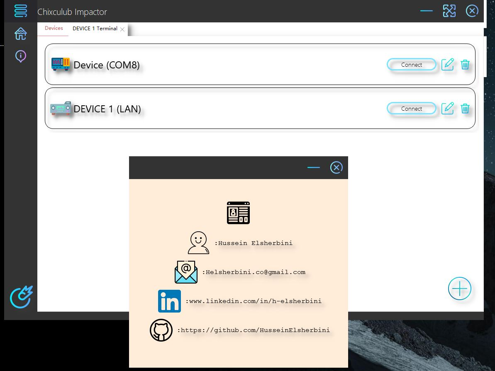

# Chixculub Impactor

Welcome, i created this project to help me easily communicate with USB/GPBIB/SERIAL/ETHERNET devices. This application
was originally intended for "test and measurement devices" however it can virtually communicate with any type of device.
it is built with python using the PyQt framework and PyVisa.

## Screenshots

  
## Features

- Auto detection of connection/disconnection of USB/Serial/Gpib devices
- Seamless communication through a seperate terminal for each devices or a script area that can target multiple devices in one script (great for automation testing)
- Multithread application so multiple scripts can run simultaneously in the background
- Manual addition of Ethernet devices.

  
## Used By

This project is used by the following companies:

- Techs working in Manufacturing facilities/labs
- Engineers wishing to communicate with Embedded devices
- Hobbyists

  
## Installation 

- run CISetup
- download and install latest NI visa drivers https://www.ni.com/en-us/support/downloads/drivers/download.ni-visa.html#346210 (only download the drivers, the rest of the suite isn't necessary)
- restart PC
    
## License

[MIT](https://choosealicense.com/licenses/mit/)

